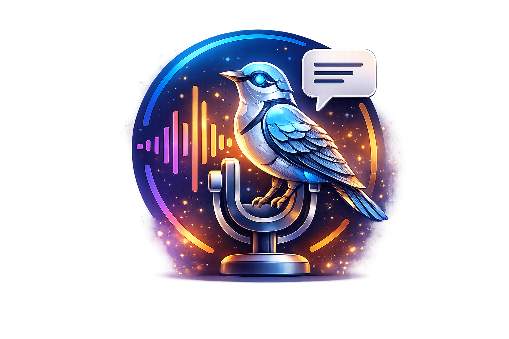

<div align="center">



# Mockingbird

**Local, offline voice cloning desktop app powered by VoxCPM2**

[](https://www.python.org/)
[](https://pypi.org/project/PyQt6/)
[](https://github.com/OpenBMB/VoxCPM)
[](https://www.microsoft.com/windows)
[](#)
[](https://github.com/Marijn-Deijnen/Mockingbird/releases/latest)

</div>

---

## What is Mockingbird?

Mockingbird is a desktop GUI for reference-based voice cloning. Import any short audio clip as a voice reference, type what you want it to say, and generate a cloned voice — entirely on your own machine, with no cloud dependency.

---

## Features

| | Feature | Description |
|---|---|---|
| 🎙️ | **Voice library** | Import `.wav` or `.mp3` files as named voices, stored locally |
| 🎛️ | **Per-voice settings** | CFG value, inference steps, and denoiser saved per voice |
| 🎭 | **Style prefix** | Set a tone/emotion/pace description (e.g. `cheerful, slightly faster`) applied to every generation |
| ▶️ | **Playback** | Listen to generated output directly in the app, with optional auto-play on complete |
| 🏷️ | **File naming** | Rename outputs inline, or let AI name them automatically |
| 📚 | **Library** | Browse, filter, play and delete all generated files |
| ⚡ | **Model caching** | Model loads once at startup and stays warm — no reload delay |
| 🖥️ | **GPU acceleration** | CUDA used automatically when available, falls back to CPU |
| 🤖 | **AI assistant** | Optional Ollama integration for prompt generation, auto-naming, and customisable system prompt |

---

## Download

Pre-built Windows executables are available on the [Releases page](https://github.com/Marijn-Deijnen/Mockingbird/releases/latest). Download the latest `Mockingbird-vX.X.X.zip`, extract it, and run `Mockingbird.exe` — no Python install required.

> **Note:** The VoxCPM2 model weights (~2 GB) are downloaded automatically on first launch and cached locally. An internet connection is only needed for this one-time download.

---

## Getting Started

### Requirements

- **Python 3.11+**
- **PyTorch** — with CUDA for GPU acceleration (recommended):
  ```bash
  pip install torch torchvision torchaudio --index-url https://download.pytorch.org/whl/cu121
  ```
- **[Ollama](https://ollama.com)** *(optional)* — for AI prompt generation and auto-naming

### Installation

```bash
# 1. Clone the repo
git clone https://github.com/Marijn-Deijnen/Mockingbird.git
cd Mockingbird

# 2. Install dependencies
pip install pyqt6 voxcpm soundfile requests imageio-ffmpeg

# 3. Run
python main.py
```

> FFmpeg is bundled via `imageio-ffmpeg` — no separate system install required.

---

## Usage

### Basic workflow

```
Voices tab → Add Voice → Import a .wav or .mp3 and give it a name
     ↓
Generate tab → Select voice → Type text → Adjust settings → Generate
     ↓
Output appears with playback controls — rename inline or let AI name it
     ↓
Library tab → Browse, filter, replay, or delete past generations
```

### Voice Settings

| Setting | Default | Description |
|---|---|---|
| **CFG Value** | `2.0` | Classifier-free guidance scale `(0.1 – 10.0)`. Higher = more faithful to reference style |
| **Inference Steps** | `10` | Diffusion sampling steps. More steps = slower but potentially cleaner output |
| **Use Denoiser** | Off | Apply a post-processing denoiser pass to the output |

Settings are saved per voice and restored automatically when you switch voices.

### Style Prefix

In **Settings → General Settings**, enter a comma-separated description in the **Style prefix** field (e.g. `warm, slightly slower`). It is prepended to every generation as `(warm, slightly slower)Your text here`, giving you persistent tone and pace control without modifying your text each time.

### AI Assistant *(optional)*

1. Open the **Settings** tab
2. Enter your Ollama host and port, click **Connect**, and select a model
3. Enable the **Enable AI features** toggle
4. Optionally edit the **AI System Prompt** — use `{voice_name}` as a placeholder for the currently selected voice (e.g. `Write in the style of {voice_name}.`)
5. Enable **Show AI Prompt panel** to show the prompt box in the Generate tab
6. Describe what you want the AI to say → click **Ask AI** → result fills the text box
7. After each generation the AI also suggests a filename (up to 5 words) automatically

---

## Credits

Voice cloning model: [VoxCPM2](https://github.com/OpenBMB/VoxCPM) by [OpenBMB](https://github.com/OpenBMB)
